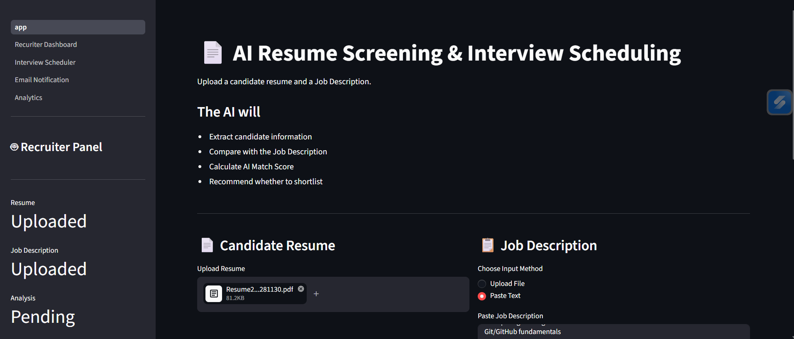
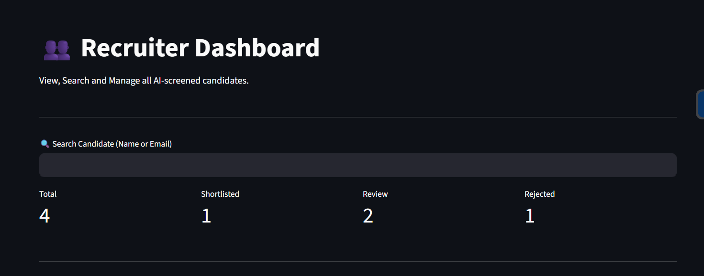
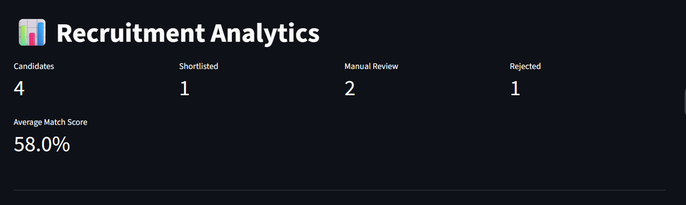
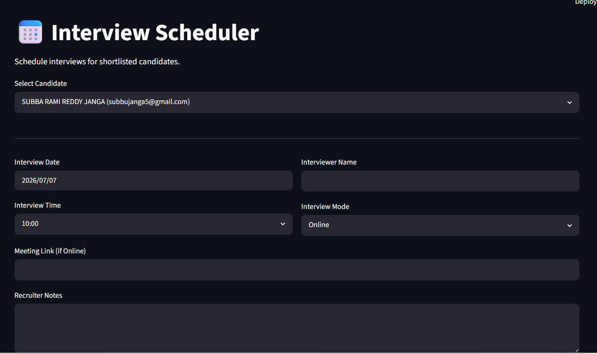
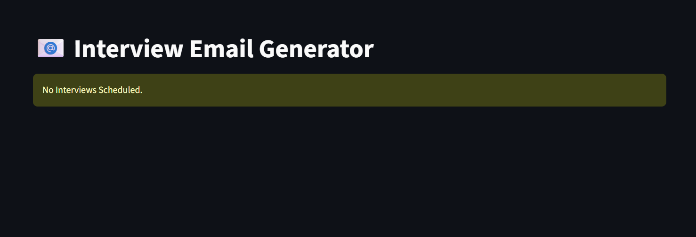

# 🤖 AI Resume Screening & Interview Scheduling System

An AI-powered recruitment platform that automates resume screening, candidate evaluation, interview scheduling, recruiter analytics, and email generation using **Google Gemini AI**.

---

## 📌 Overview

The AI Resume Screening & Interview Scheduling System simplifies the hiring process by leveraging Large Language Models (LLMs) to analyze resumes, compare them with job descriptions, calculate AI Match Scores, and automatically recommend candidates for recruitment.

---

## ✨ Key Features

- 📄 Resume Parsing (PDF & DOCX)
- 🤖 AI Candidate Information Extraction
- 🎯 Resume vs Job Description Matching
- 📊 AI Match Score Calculation
- ✅ Automatic Candidate Shortlisting
- 👤 Recruiter Dashboard
- 📈 Recruitment Analytics
- 📅 Interview Scheduler
- 📧 Interview Email Generator
- 💾 SQLite Database Integration
- 📥 Candidate Report Download (PDF)

---

# 🛠 Tech Stack

| Category | Technologies |
|----------|--------------|
| Frontend | Streamlit |
| Backend | Python |
| AI Model | Google Gemini 2.5 Flash |
| Database | SQLite |
| Libraries | Streamlit, Google Generative AI, Pandas, Matplotlib, pdfplumber, python-docx |

---

# 📂 Project Structure

```text
AI-Resume-Screening/
│
├── app.py
├── database.py
├── prompts.py
├── requirements.txt
├── README.md
├── LICENSE
├── .gitignore
├── .env.example
│
├── docs/
│
├── pages/
│
├── screenshots/
│
├── uploads/
│
└── utils/
```

---

# ⚙️ Installation

### Clone Repository

```bash
git clone https://github.com/Subbu2542/AI-Resume-Screening.git

cd AI-Resume-Screening
```

---

### Create Virtual Environment

```bash
python -m venv venv
```

Windows

```bash
venv\Scripts\activate
```

Linux / macOS

```bash
source venv/bin/activate
```

---

### Install Requirements

```bash
pip install -r requirements.txt
```

---

### Configure Environment Variables

Create a `.env` file

```env
GOOGLE_API_KEY=YOUR_GEMINI_API_KEY
```

---

### Run Application

```bash
streamlit run app.py
```

---

# 📸 Application Screenshots

## 🏠 Home Page



---

## 👤 Recruiter Dashboard



---

## 📊 Recruitment Analytics



---

## 📅 Interview Scheduler



---

## 📧 Interview Email Generator



---

# 🔄 Application Workflow

```text
Resume Upload
      │
      ▼
Resume Parsing
      │
      ▼
Candidate Information Extraction
      │
      ▼
Resume vs Job Description Matching
      │
      ▼
AI Match Score Calculation
      │
      ▼
Candidate Recommendation
      │
      ▼
SQLite Database Storage
      │
      ▼
Recruiter Dashboard
      │
      ▼
Recruitment Analytics
      │
      ▼
Interview Scheduler
      │
      ▼
Interview Email Generator
```

---

# 📖 Documentation

Detailed documentation is available in the `docs` folder.

- 📄 Project Overview
- 🏗 System Architecture
- 🗄 Database Schema
- 🔄 Workflow
- 🤖 API Usage

---

# 🚀 Future Enhancements

- 🔐 User Authentication
- 📊 Resume Ranking
- ☁ Cloud Deployment
- 🐘 PostgreSQL Integration
- 📧 Automatic Email Sending
- 👥 Multi-user Recruiter Support
- 🌐 REST API Integration

---

# 👨‍💻 Author

**Subba Rami Reddy Janga**

GitHub: https://github.com/Subbu2542

---

## ⭐ Support

If you found this project useful, consider giving it a ⭐ on GitHub.